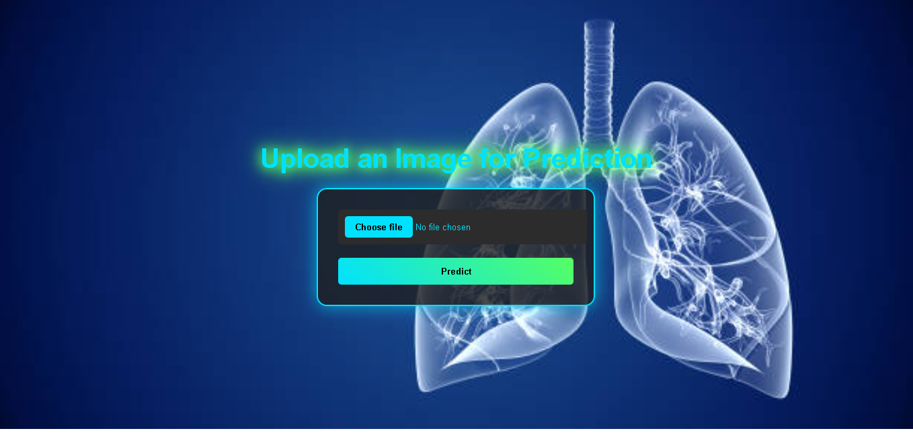
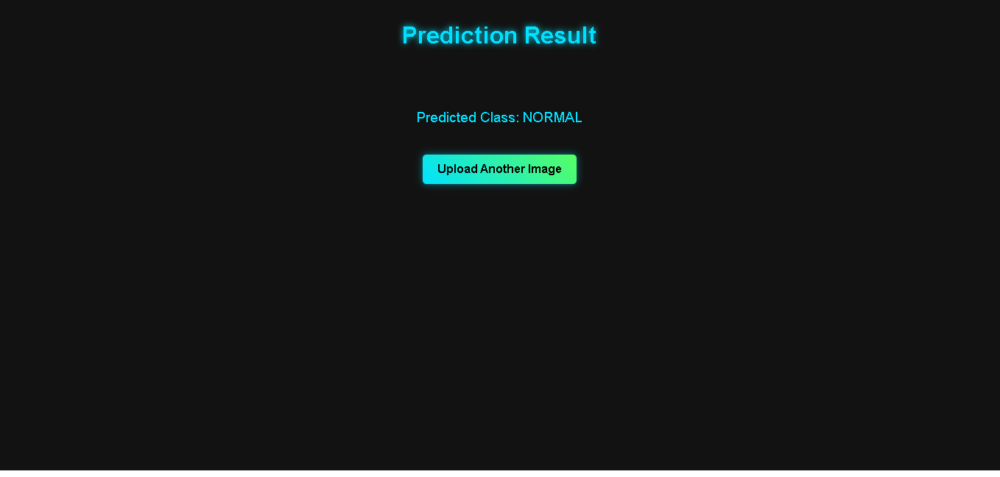

# Lung Disease Classification Using Deep Learning

## 🌟 Overview

This project provides an automated solution for **lung disease classification** using convolutional neural networks (CNNs) and a web interface for real-time predictions. It is designed to classify X-ray images into the following categories:

- **COVID-19**
- **NORMAL**
- **PNEUMONIA**
- **TUBERCULOSIS**

The system consists of:
1. **Deep Learning Model**: Trained on a labeled lung X-ray dataset.
2. **Web Application**: A user-friendly interface for uploading X-ray images and viewing predictions.

## 🚀 Features

- **Custom CNN Architecture**: A powerful yet lightweight model for classification.
- **Dataset Management**: Automatically organizes and normalizes train/test/validation data.
- **Early Stopping**: Reduces overfitting with automatic training halts.
- **Real-Time Metrics Visualization**: Plots training and validation accuracy and loss.
- **Interactive Web App**: Powered by Flask, allowing easy image uploads and predictions.
- **Modular Design**: Flexible codebase for extending functionality.

---

## 📂 Project Structure

```
LungProject/
├── Classes/
│   ├── Model.py          # Deep learning model implementation
│   ├── Web_Model.py      # Flask-based wrapper for web app
├── Data/                 # X-ray dataset (train, val, test)
├── Templates/            # HTML files for the Flask app
│   ├── index.html        # Upload interface
│   ├── result.html       # Results display
├── runs/                 # Model weights and saved logs
│   ├── best_weight.h5    # Trained model weights
├── train.py              # Script to train the model
├── web_app.py            # Flask web app script
```

---

## 🔧 Installation and Setup

### Prerequisites
- Python 3.8 or later
- Required libraries:
  ```
  TensorFlow, Keras, Flask, Pillow, Matplotlib
  ```

### Dataset Structure
Ensure your dataset has the following structure:
```
Data/
├── train/
│   ├── COVID-19/
│   ├── NORMAL/
│   ├── PNEUMONIA/
│   ├── TUBERCULOSIS/
├── val/
├── test/
```

### Train the Model
1. Place the dataset in the `Data/` directory.
2. Start training:
   ```bash
   python train.py
   ```
3. The trained model will be saved in the `runs/` folder as `best_weight.h5`.

---

## 🌐 Using the Web App

1. **Run the Web App**:
   ```bash
   python web_app.py
   ```
2. Open a browser and go to `http://127.0.0.1:5000/`.
3. Upload an X-ray image, and the app will display the predicted class.

---

## 🖼️ Screenshots

### Homepage (Image Upload Interface)
This is the main page where users can upload their X-ray images.  


### Result Page (Prediction Output)
After uploading an image, users see the predicted class.  


---

## 🛠️ Future Improvements

- Enhance the web app with advanced features (e.g., heatmaps for visual explanations).
- Use pretrained models like EfficientNet or ResNet for improved accuracy.
- Include more disease classes in the dataset.

---

## 🤝 Contributing
Contributions are welcome! Please feel free to open issues or submit pull requests to improve the project.

---

## 📝 License
This project is licensed under the MIT License.

---
